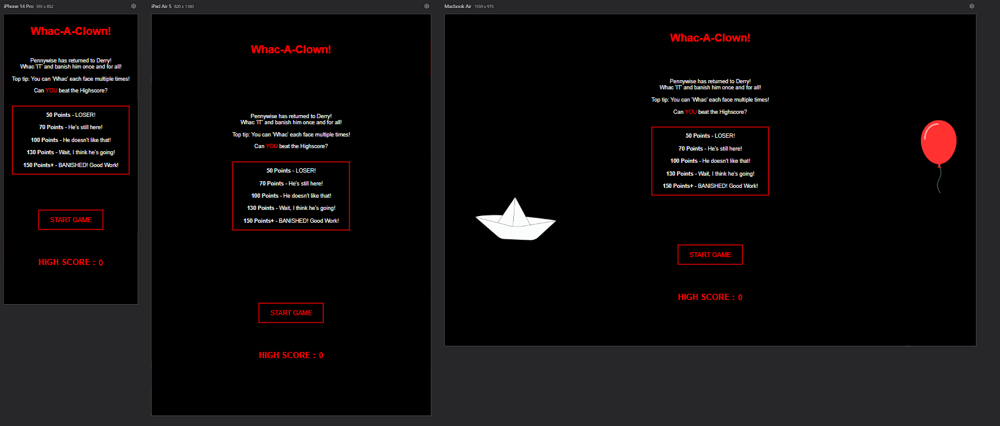
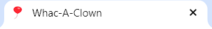
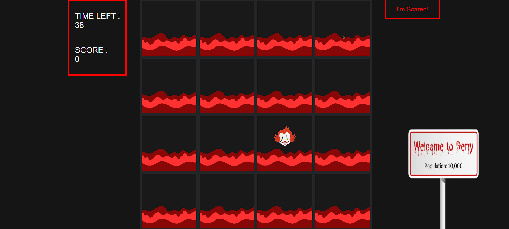
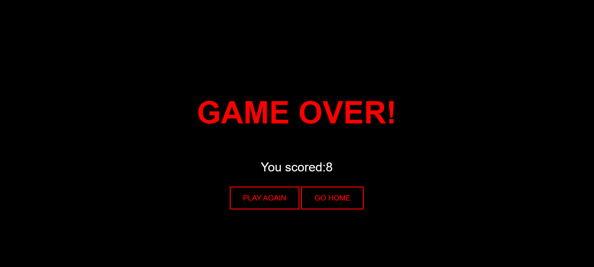
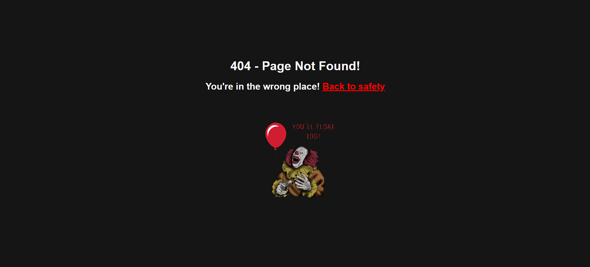
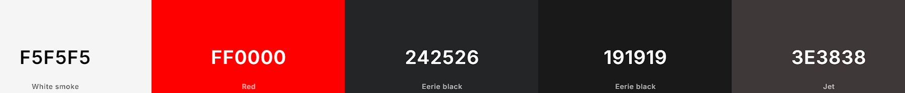
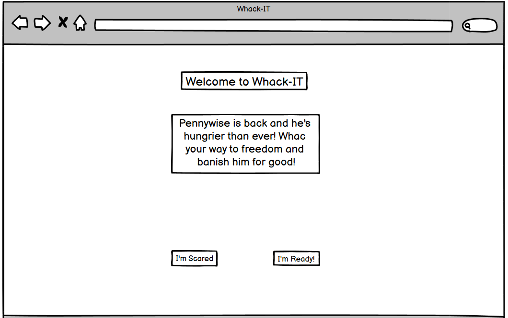
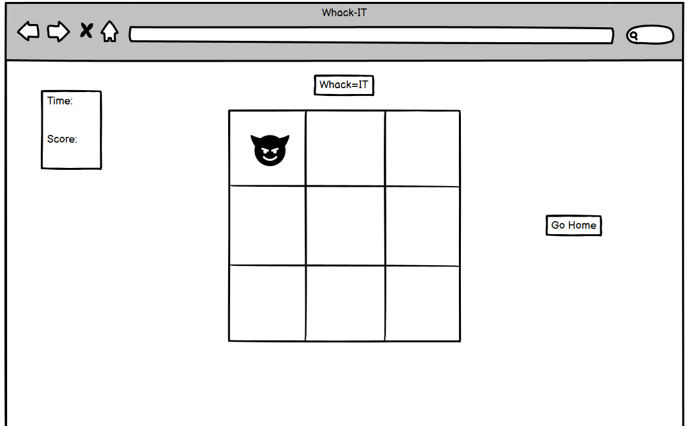
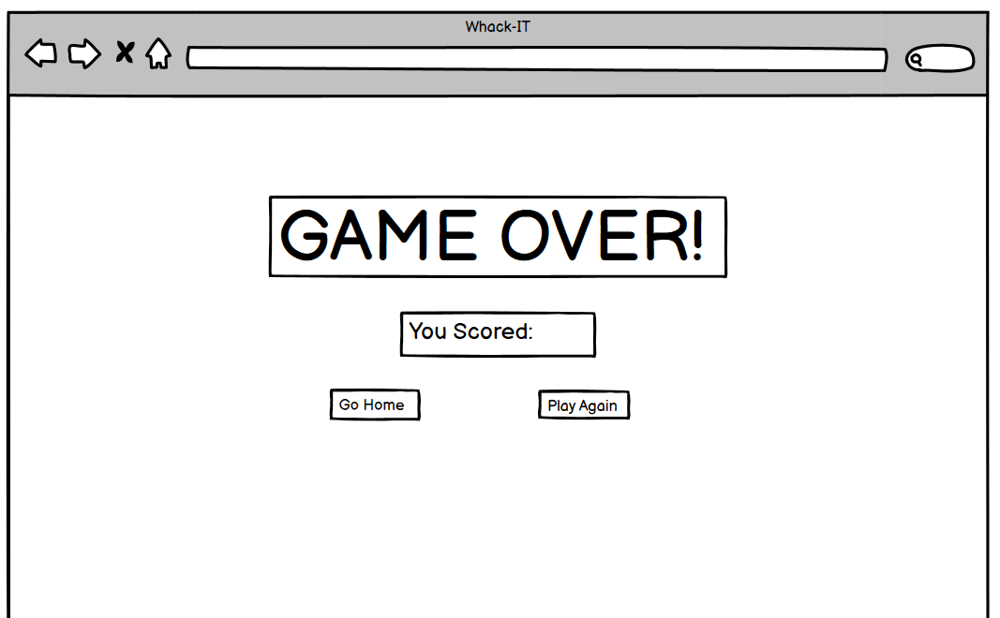

# Whac-A-Clown

# Table Of Contents

1. [Overview](#overview)
1. [User Experience](#user-experience)
1. [Features](#features)
1. [Wireframes](#wireframes)
1. [Deployment](#deployment)
1. [Testing](#testing)
1. [References](#references)
1. [Tools and Technologies](#tools-and-technologies)
1. [Acknowledgements](#Acknowledgements)

---

# Overview

Whac-A-Clown is a Javascript based 'Whac-A-Mole' style game. The theme of the game is based around the movie IT. The game features clown faces that pop up for a short period of time before dissapearing. The object is to hit the faces as many times as possible in the given time limit.

# User Experience

## Target Audience

- Ages 10-40 but can appeal to all ages.
- All genders.
- Those with an interest in horror games.
- Those with an interest in horror movies.
- Those who are seeking a break from their work for a few minutes.
- Competitive players who want to challenge their friends.
- Solo players.
- Groups of people.

## First Time Visitor Goals

- Immediately know what the website is for, and the intended purpose that they are there to play a game.
- Be able to navigate the website with ease with all links working as they should.
- Have the option to return home or play again when the game is finished.
- Have confidence in the website by sensing that the website is genuine and professional i.e. no broken links or typos.
- Have a senese of excitement when playing the game.

## Returning Visitor Goals

- Expect the game to work as it should.
- Bring friends and family to play the game.

## Frequent Visitor Goals

- Be familiar with the game and controls.
- Have a sense of achivevement by beating thier own highscores.
- Bring friends and family and use the game competitively.

# Features

## Start Page

A starting page that has clear intentions.
- Title - A title that tells the user what the game is called.
- Intro - A foreword to set the scene of the game.
- Top tip - A hint to help users of the game with their experience.
- Score board - A list of targets to beat whilst playing the game.
- Start button - A button that inverts colours to know that it is interactive when hovered over - this will start the game.
- Styling - Themed images to set atmosphere.

Start Page desktop view:

Start Page mobile view:

### Start Page Interaction

- Inverted colours when start button is hovered over.

## Favicon

- Red balloon favicon icon in site tab to match webiste theme.

Themed favicon:

# Site Pages

## Start Page

- Dark background colour.
- Large title.
- Introductory wording and help tip.
- Score board goals.
- Start button.
- Current highscore.
- Themed images.

Start Page preview:

## Game Page

- Current score and timer.
- Themed game board with clickable element.
- Themed images.

Game Page preview:

## Game Over Page

- Game Over text.
- Player score.
- Play again button.
- Return home button.

Game Over page preview:

## Custom 404

- Custom themed image.
- Link button back to home page.

404 page preview:

# Design

### Colours

- Dark colours and lights reds to compliment the theme of the movie.
- Most text/wording in bright red.
- Dark black and grey background colours.
- Buttons change to white with red text - inverted from black when hovered.
- Game board matches color styling with red and black.

Colour palette:

### Fonts

- Google fonts supplied all text styles.
- Ariel fonts used throughout.

- Font Awesome was used for the favicon icon.

# Wireframes

- Balsamiq was used to create the wireframes.

Start page:

Game page:

Gameover page:

# Deployment

### Github Pages

The site was deployed to Github Pages using the following method:

- Go to the Github repository.
- Navigate to the 'settings' tab.
- Using the 'select branch' dropdown menu, choose 'main'.
- Click 'save'.

### Local deployment and cloning

To make a clone of the site and ensure you don't affect the original:

- Navigate to the Github repository that you want to clone.
- Click on the 'down'arrow on the green 'code' button.
- Copy the URL link.
- Open the workspace with the green 'open' button.
- In the command terminal enter 'git clone' followed by the copied url.
- Press enter to create the clone.

# Testing

Please go to [testing.md](testing.md) to see the test procedures and results.

# References

### Images

All images are royalty free and/or created by myself and were taken from allowed sources. Images are downloaded and added to the assets file to ensure no broken links arise.

- Start page images created using Canva.
- Game page images and elements created using Canva.

### Code

Code is a combination of my own code and help/guide videos:

- https://www.youtube.com/watch?v=UnrtgpQlAz4
- https://www.youtube.com/watch?v=ej8SatOj3V4

# Tools and Technologies

- [canva](https://www.canva.com/) to create custom 404 page image.
- [HTML](https://en.wikipedia.org/wiki/HTML) was used to write the website code.
- [CSS](https://en.wikipedia.org/wiki/CSS) was used to style the website.
- [Gitpod](https://gitpod.io/) as online IDE.
- [Github](https://github.com) and Github Pages to deploy and host the website.
- [Google](https://www.google.co.uk/) as a search engine for all queries.
- [GoogleChrome](https://www.google.com/intl/en_uk/chrome/?brand=QCTP&gad_source=1&gclid=CjwKCAjwhIS0BhBqEiwADAUhc2pz-_bvU7f850ozLnJ1cfu6Y8tIfP4BXfL7naeQKo15Tjzwkt3U5hoClfYQAvD_BwE&gclsrc=aw.ds) to test and view website.
- [GoogleDevTools](https://developer.chrome.com/docs/devtools) to identify bugs and general website tailoring.
- [coolors](https://coolors.co/) to create the colour palette.
- [Balsamiq](https://balsamiq.com/) to create the wireframes.
- [TinyPNG] (https://tinypng.com/) to convernt images from PNG to WebP.
- [ResponsiveViewer](https://responsiveviewer.org/) to create multiple device image.

# Acknowledgements

A big thank you to my cohort facilitator, Lewis Dillon, my mentor, Gareth McGirr, fellow students and their support and Joshua Thorley for advice and support.