# Testing

## Table Of Contents

1. [Code Validation](#code-validation)
1. [Site Responsiveness](#site-responsiveness)
1. [Manual Testing](#manual-testing)
1. [Browser Compatibility](#browser-compatibility)
1. [Performance](#performance)
1. [Bugs](#bugs)
1. [Unsolved Bugs](#unsolved-bugs)

# Code Validation

### HTML

### index.html:

- No errors or warnings to show.

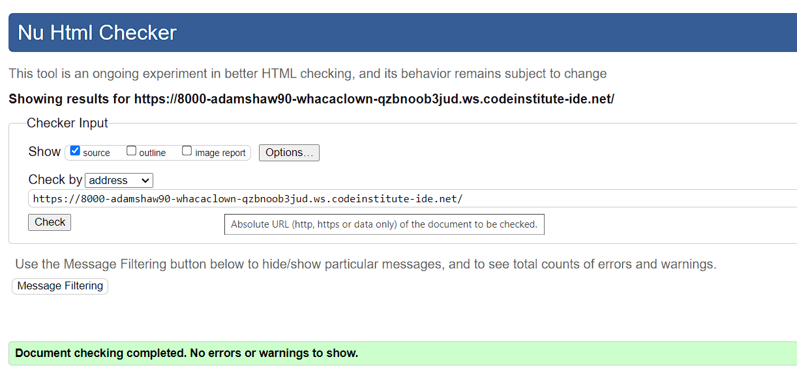

### 404.html:

- No errors or warnings to show.

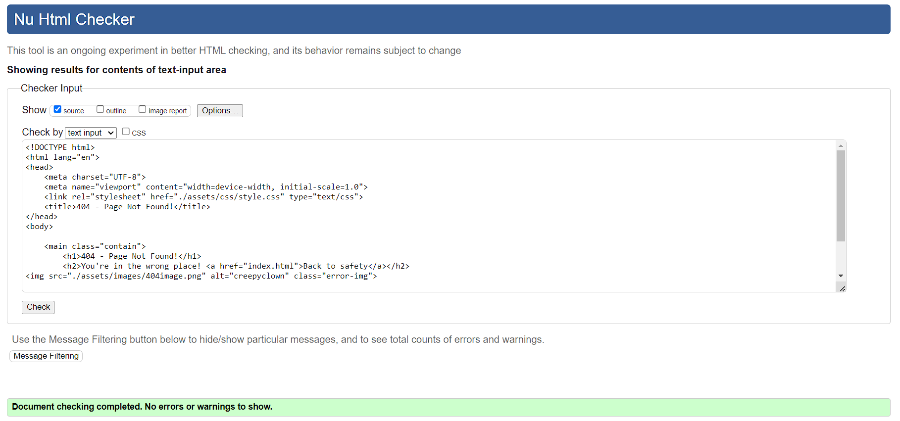

### CSS

- No errors or warnings to show.

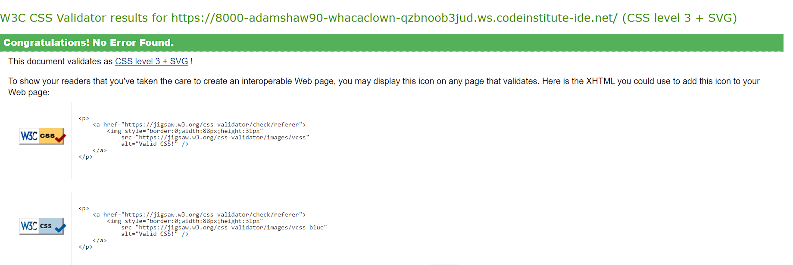

### JavaScript

- No errors or warnings to show.

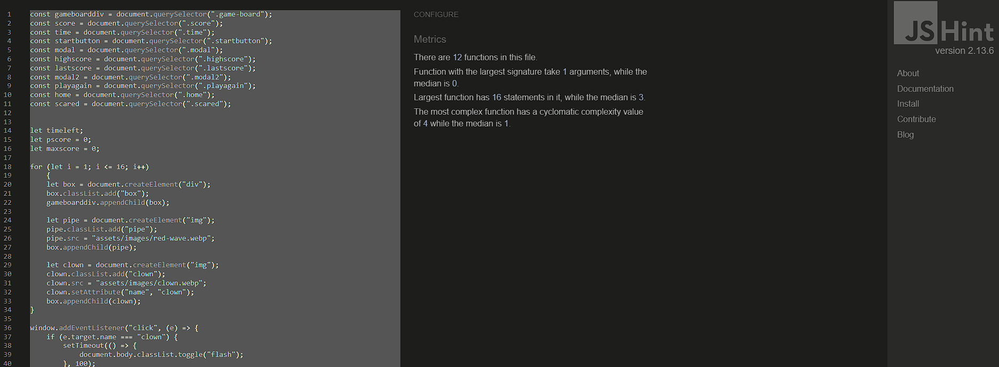

# Site Responsiveness

The website has been tested on multiple devices to ensure responsiveness remains on whatever device the webisite is loaded to.

### Desktop

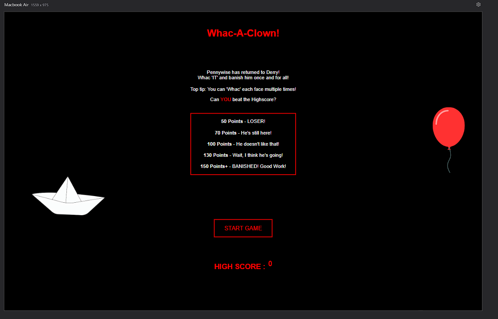

### Iphone 15

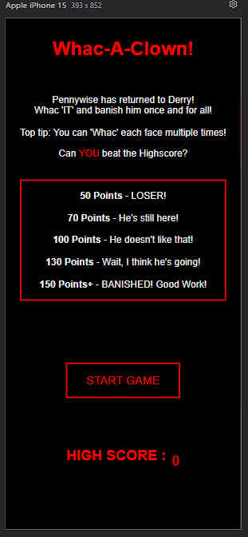

### Fire Tablet

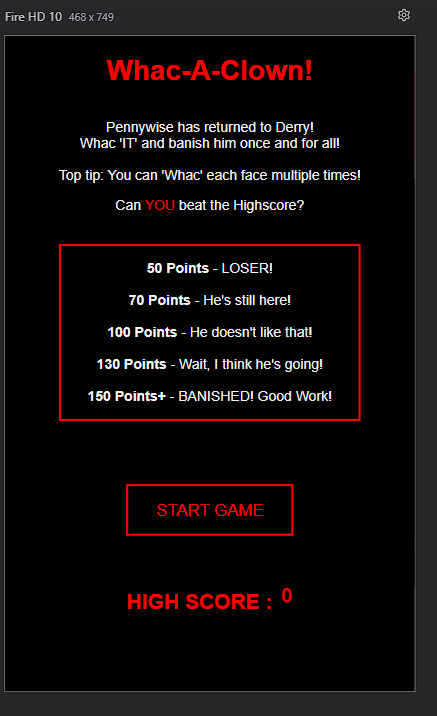

# Manual Testing

Manual testing was carried out on all elements of the site to ensure that everything worked as expected.

Testing also carried out by multiple people in addition to myself.

| ELEMENT | PROCESS | EXPECTED RESULT | OUTCOME |
| ------- | ------- | --------------- | ------- |
| Start game button | Click | Navigate to game page | Successful |
| 'I'm Scared' button | Click | Return to homepage | Successful |
| Clown face pop up | Click | Add 1 to score | Successful |
| Timer | Timer | 60 seconds decreasing by 1 second | Successful |
| 'Play Again' button | Click | Navigate to game page | Successful |
| 'Go Home' button | Click | Navigate to start page | Successful |
| Broken link | Enter | Navigate to 404 page | Successful |

# Browser Compatibility

This website has been tested across multiple browsers to ensure it can be transitioned smoothly.

### Google Chrome:

- No issues.

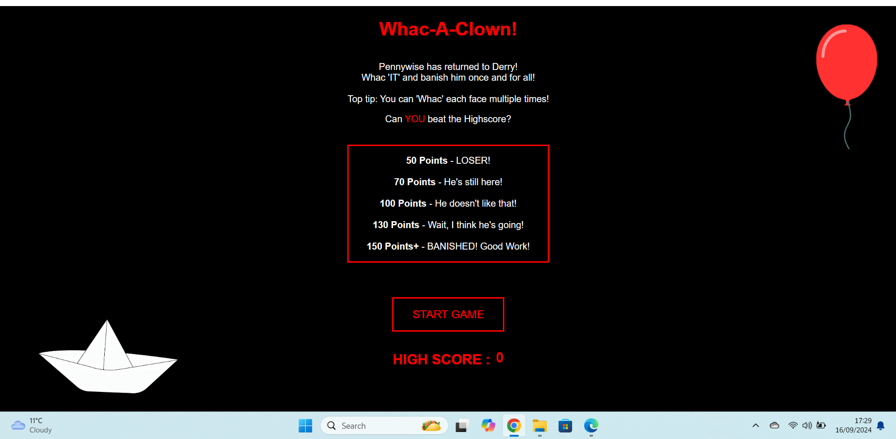

### Mozilla Firefox:

- No issues.

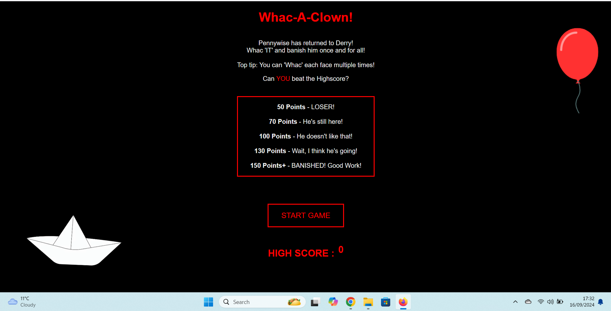

### Microsoft Edge:

- No issues.

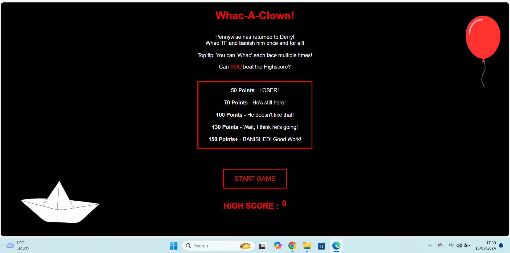

# Performance

Lighthouse was used to verify that the web pages are performing well and are are well optimized.

### Main page and modals desktop:

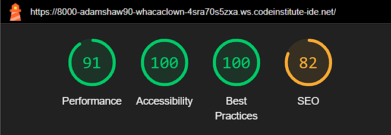

### Main page and modals mobile:

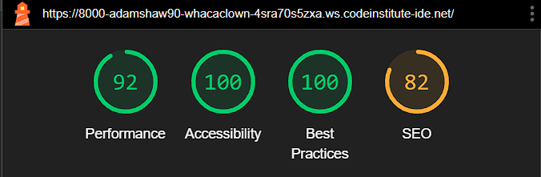

# Solved Bugs

## Clown element not appearing

- There was an issue with the clown element not appearing on the game board.

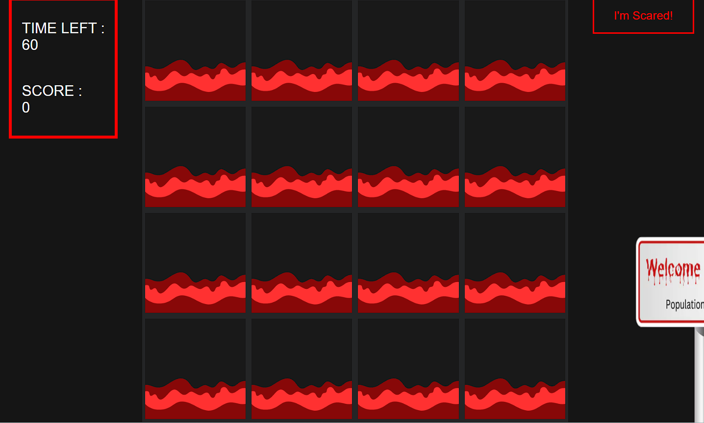

- To fix this issue, I had to change the z-index as the clown was sat behind the box element.

## Buttons not moving

- The Play Again and Go Home buttons were not moving from the left hand side of the page.

- To fix this issue I had to add text-align: center; to my modal 2 element. This centered the buttons.

## No responsiveness for the game

- I had issues with the responsiveness at certain sizes.

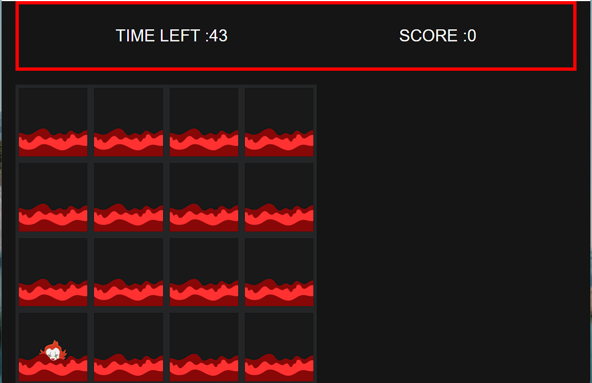

- I had to add media queries for mobile and tablet sizes.

# Unsolved Bugs

- All bugs solved.